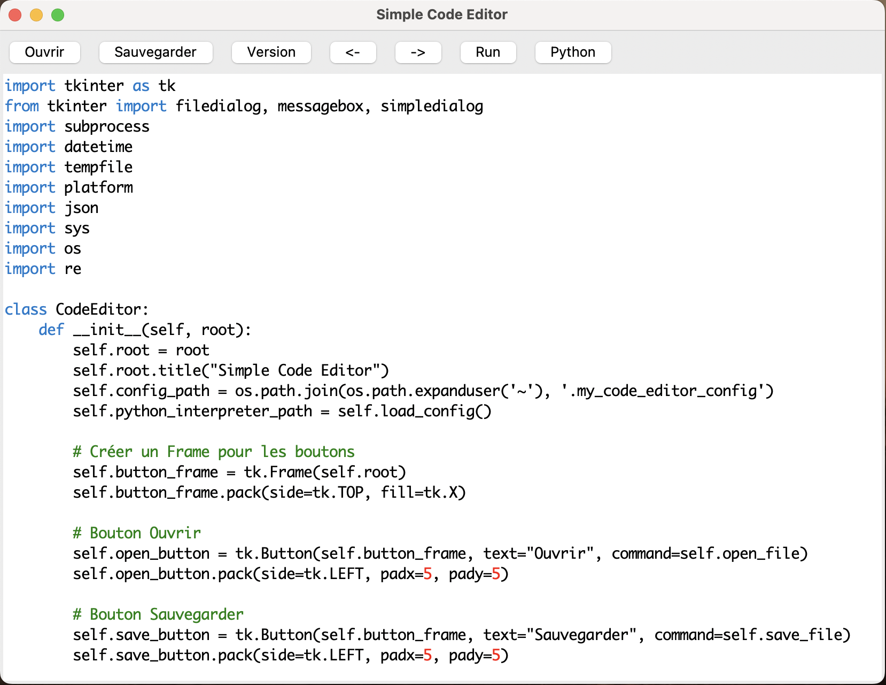

# SimpleCodeEditor
A lightweight, Python-based text editor tailored for coding and script execution. Developed using Tkinter, this editor integrates basic functionalities such as opening, editing, saving files, and version management, alongside syntax highlighting for Python, CSS, and JavaScript. Moreover, it features the unique capability to directly execute Python scripts within the editor, ensuring a streamlined workflow for Python developers.

## Features
File Operations: Open, edit, and save text files with ease.
Syntax Highlighting: Supports basic syntax highlighting for Python, CSS, and JavaScript, enhancing readability and coding efficiency.
Script Execution: Execute Python scripts directly from the editor, with the flexibility to specify or change the Python interpreter path.
Version Management: Save versions of your work to track changes or revert to earlier versions.
Customizable Python Path: Easily update the path to the Python interpreter to suit your development environment, ensuring compatibility and flexibility.
Text Manipulation: Quickly indent or dedent selected text, facilitating code formatting and readability.

## How to Use
Upon launching the Simple Code Editor, you'll find a straightforward interface with a menu bar and a toolbar at the top, alongside a spacious area for code editing.

Opening Files: Click the "Open" button or choose "Open" from the "File" menu.

Saving Files: Use the "Save" button for quick saves. 

To create a timestamped version of the current file, use the "Version" button.

Executing Python Scripts: Press the "Run" button. If it's the first run, you'll be prompted to specify the Python interpreter path.

Changing the Python Path: Should you need to change the Python interpreter, click the "Python" button to update the path.
Customization

The editor allows for basic syntax highlighting customization through the highlight_patterns method. Modify patterns here to adjust syntax highlighting to fit your needs.

## Compiling
The Simple Code Editor is not only user-friendly but also developer-friendly. Compiling it into a standalone executable is straightforward with PyInstaller, making distribution and deployment effortless. Simply run pyinstaller --onefile codeeditor.py from your terminal, and PyInstaller will generate a single executable file for your platform. This process encapsulates all the necessary dependencies, allowing the editor to be used on any compatible system without requiring Python to be installed. Additionally, for those who prefer working directly with the script, running the editor is as simple as executing python codeeditor.py in your command line. This flexibility ensures that whether you're looking to share your tool with others or just need a quick and lightweight code editor for personal use, the Simple Code Editor meets your needs with ease.

## License
This project is open-sourced under the MIT License. See the LICENSE file for more details.

## Contributions
Contributions are welcome! If you'd like to improve the Simple Code Editor, feel free to fork the repository and submit a pull request.
