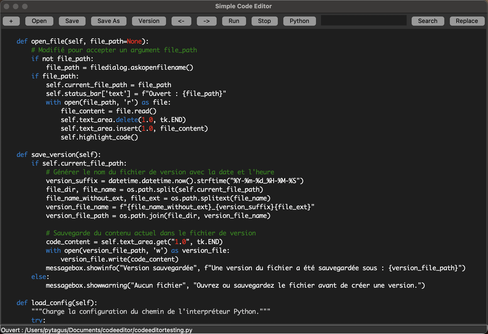

# SimpleCodeEditor
A lightweight, Python-based text editor tailored for coding and script execution. Developed using Tkinter, this editor integrates basic functionalities such as opening, editing, saving files, and version management, alongside syntax highlighting for Python, CSS, and JavaScript. Moreover, it features the unique capability to directly execute Python scripts within the editor, ensuring a streamlined workflow for Python developers.

## Features

- **New**: Create a new file.
- **Open**: Open an existing file.
- **Save**: Save the current file.
- **Save As**: Save the current file with a new name/location.
- **Version**: Save a version of the current file with timestamp.
- **Move Left**: Move the selected text left by one indentation level.
- **Move Right**: Move the selected text right by one indentation level.
- **Run**: Execute the Python script.
- **Stop**: Stop the execution of the running script.
- **Python**: Change the Python interpreter path.
- **Search**: Search for text in the code.
- **Replace**: Search and replace text in the code.

## Usage

1. **New**:
   - Click on the "+" button to create a new file.
   - This will clear the current text area and reset the current file path.

2. **Open**:
   - Click on the "Open" button to open an existing file.
   - This will prompt you to select a file from your file system.
   - Once selected, the contents of the file will be displayed in the text area.

3. **Save**:
   - Click on the "Save" button to save the changes made to the current file.
   - If the file has not been previously saved, this will behave like "Save As".

4. **Save As**:
   - Click on the "Save As" button to save the current file with a new name or in a new location.
   - This will prompt you to choose a location and enter a filename for the file to be saved.

5. **Version**:
   - Click on the "Version" button to save a version of the current file with a timestamp.
   - This will create a copy of the current file with the timestamp appended to the filename.

6. **Move Left**:
   - Select text in the editor.
   - Click on the "<-" button to move the selected text left by one indentation level.

7. **Move Right**:
   - Select text in the editor.
   - Click on the "->" button to move the selected text right by one indentation level.

8. **Run**:
   - Click on the "Run" button to execute the Python script.
   - Before running, make sure to save the file.
   - This will execute the Python script using the configured Python interpreter.

9. **Stop**:
   - Click on the "Stop" button to stop the execution of the running script.
   - This is useful if you need to interrupt a long-running or problematic script.

10. **Python**:
    - Click on the "Python" button to change the Python interpreter path.
    - This will prompt you to enter the path to the Python interpreter.

11. **Search**:
    - Enter text in the search box.
    - Click on the "Search" button to find occurrences of the text in the code.
    - The first occurrence will be highlighted, and you can click the button again to find the next occurrence.

12. **Replace**:
    - After searching for text, enter replacement text in the provided field.
    - Click on the "Replace" button to replace the found text with the specified replacement text.

## Requirements

- Python 3.x
- Tkinter
- Tkinterdnd2

## Compiling
The Simple Code Editor is not only user-friendly but also developer-friendly. Compiling it into a standalone executable is straightforward with PyInstaller, making distribution and deployment effortless. Simply run pyinstaller --onefile codeeditor.py from your terminal, and PyInstaller will generate a single executable file for your platform. This process encapsulates all the necessary dependencies, allowing the editor to be used on any compatible system without requiring Python to be installed. Additionally, for those who prefer working directly with the script, running the editor is as simple as executing python codeeditor.py in your command line. This flexibility ensures that whether you're looking to share your tool with others or just need a quick and lightweight code editor for personal use, the Simple Code Editor meets your needs with ease.

## License
This project is open-sourced under the MIT License. See the LICENSE file for more details.

## Contributions
Contributions are welcome! If you'd like to improve the Simple Code Editor, feel free to fork the repository and submit a pull request.
